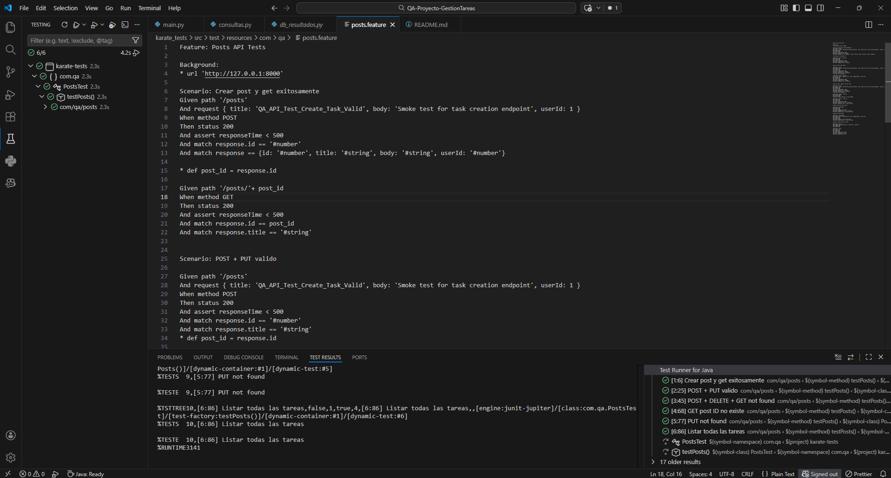
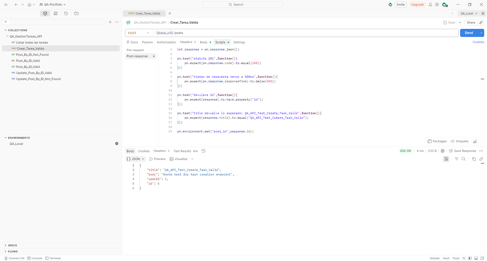
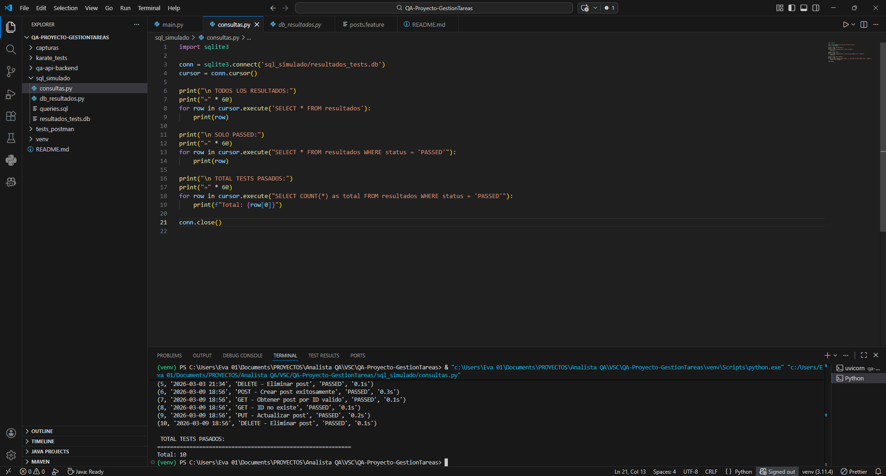

# QA Proyecto - Gestión de Tareas

Proyecto de automatización de pruebas QA sobre una API REST construida con FastAPI. Incluye pruebas con Postman, automatización con Karate y registro de resultados en SQLite.

---

## Tecnologías utilizadas

- **Python + FastAPI** → API REST backend
- **Postman** → Pruebas manuales y exploración de endpoints
- **Karate Framework** → Automatización de pruebas
- **Maven + Java 17** → Ejecución de tests Karate
- **SQLite** → Base de datos para registro de resultados

---

## Estructura del proyecto

```
QA-PROYECTO-GESTIONTAREAS
├── capturas/               → Screenshots de resultados
├── karate_tests/           → Tests automatizados con Karate
│   ├── pom.xml
│   └── src/test/resources/com/qa/posts.feature
├── qa-api-backend/         → API REST con FastAPI
│   └── main.py
├── sql_simulado/           → Base de datos SQLite con resultados
│   ├── db_resultados.py
│   ├── consultas.py
│   ├── queries.sql
│   └── resultados_tests.db
├── tests_postman/          → Colección exportada de Postman
│   ├── QA_GestionTareas_API.postman_collection.json
│   └── QA_Local.postman_environment.json
└── venv/
```

---

## Cómo correr el proyecto

### 1. Levantar la API

```bash
cd qa-api-backend
uvicorn main:app --reload
```

La API estará disponible en: `http://127.0.0.1:8000`

### 2. Correr tests con Karate

```bash
cd karate_tests
mvn test
```

El reporte HTML se genera en:

```
karate_tests/target/karate-reports/karate-summary.html
```

### 3. Importar colección en Postman

1. Abrir Postman
2. Import → seleccionar `QA_GestionTareas_API.postman_collection.json`
3. Import → seleccionar `QA_Local.postman_environment.json`
4. Seleccionar environment `QA_Local`

---

## Endpoints de la API

| Método | Endpoint | Descripción |
|--------|----------|-------------|
| POST | `/posts` | Crear un post |
| GET | `/posts` | Listar todos los posts |
| GET | `/posts/{id}` | Obtener post por ID |
| PUT | `/posts/{id}` | Actualizar post |
| DELETE | `/posts/{id}` | Eliminar post |

---

## Scenarios de prueba en Karate

| # | Scenario | Resultado esperado |
|---|----------|-------------------|
| 1 | POST + GET exitoso | Status 200, datos correctos |
| 2 | POST + PUT válido | Status 200, datos actualizados |
| 3 | POST + DELETE + GET not found | Status 200, mensaje de eliminado |
| 4 | GET ID no existe | Status 200, error "Post not found" |
| 5 | PUT ID no existe | Status 200, error "Post not found" |
| 6 | Listar todas las tareas | Status 200, respuesta es array |

---

## Resultados

### Karate - 6/6 tests pasando


### Postman - Colección completa


### SQLite - Resultados registrados


---

## Base de datos SQLite

Los resultados de los tests se registran en `resultados_tests.db`. Para consultar:

```bash
cd sql_simulado
python consultas.py
```

---

## Notas

- La API guarda los datos en memoria, se reinician al apagar el servidor.
- Levantar la API antes de correr cualquier test.

---

## Autor

**David Fernando Solano Garcia** - Analista de Datos & QA Junior

LinkedIn: https://www.linkedin.com/in/david-fernando-solano-garcia-840230348

Última actualización de prueba.